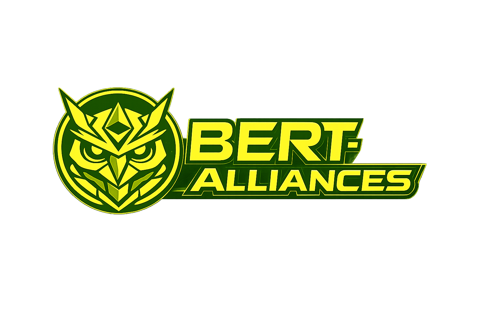

 
      
  

**FlashAlliance**
 is a standalone ERC20-funded collective NFT trading module.
Each `Alliance` instance is a self-contained pool with fixed participants and fixed ownership shares.

This module is intentionally separate from BERT core governance contracts.
In BERT terms, FlashAlliance should be treated as an ecosystem add-on product, not a core DAO primitive.
Administrative controls are local (`Ownable`) per alliance.

Note: Please read the Contract [Documentation](https://bertdao-docs.vercel.app) before integrating with this repo.

**Core Flow**

1. Participants deposit ERC20 in `Funding`.
2. Alliance buys NFT when target is reached.
3. Participants vote sale params in `Acquired`.
4. Sale executes and proceeds are split by fixed shares.
5. If funding fails, participants withdraw refunds.
6. Emergency NFT withdrawal is available via participant quorum.

**Contract Documentation**
See: [docs/CONTRACTS.md](docs/CONTRACTS.md)

**Learn More**
1. Documentation: [website](https://bertdao-docs.vercel.app)
2. BERT core repository: [repository](https://github.com/Tenyokj/bert-core)
3. Main site: [website](https://bertdao.vercel.app)
4. Bert-Alliances site: [website](https://bert-alliances.vercel.app)

**Docs**

1. Getting started: `docs/GETTING_STARTED.md`
2. Architecture: `docs/ARCHITECTURE.md`
3. Contracts index: `docs/CONTRACTS.md`
4. Config: `docs/CONFIG.md`
5. Security: `docs/SECURITY.md`
6. Operations: `docs/OPERATIONS.md`
7. FAQ: `docs/FAQ.md`
8. Glossary: `docs/GLOSSARY.md`
9. Upgrades policy: `docs/UPGRADES.md`
10. Testing guide: `test/docs_tests/TESTING.md`
11. Deployment guide: `scripts/docs_deploy/DEPLOY.md`

**Disclaimer**

This repository contains the core smart contracts of the protocol. The codebase may evolve rapidly, so older guides may not match the current layout. Refer to the latest docs for accurate integration guidance.

**License**

2025 BERT info@tenyokj

This program is free software: you can redistribute it and/or modify it under the terms of the GNU General Public License as published by the Free Software Foundation, version 3 of the License, or any later version.

This program is distributed in the hope that it will be useful, but WITHOUT ANY WARRANTY; without even the implied warranty of MERCHANTABILITY or FITNESS FOR A PARTICULAR PURPOSE. See the GNU General Public License for more details.

You should have received a copy of the GNU General Public License along with this program. If not, see https://www.gnu.org/licenses/.

